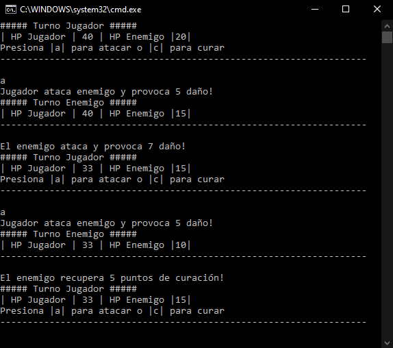
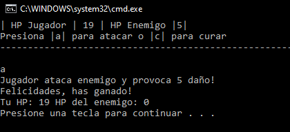

# Juego de Combate en Consola - C# .NET

Este es un sencillo juego de combate por turnos desarrollado en C# .NET Framework. En este juego, el jugador se enfrenta a un enemigo en una batalla en la que ambos pueden atacar o curarse hasta que uno de los dos pierda toda su vida (HP).

## Funcionalidades

- **Combate por Turnos:** El jugador y el enemigo alternan turnos para atacar o curarse.
- **Acciones del Jugador:** El jugador puede elegir entre atacar o curarse durante su turno.
- **Acciones del Enemigo:** El enemigo toma decisiones aleatorias para atacar o curarse.
- **Condiciones de Victoria/Derrota:** El juego finaliza cuando el HP del jugador o del enemigo llega a cero, mostrando un mensaje de victoria o derrota.

## Requisitos

- .NET Framework 4.7 o superior
- IDE compatible con C# (Visual Studio recomendado)

## Cómo jugar

1. **Compilación:**
   - Clona el repositorio en tu máquina local.
   - Abre el proyecto en Visual Studio.
   - Compila y ejecuta el proyecto.

2. **Inicio del Juego:**
   - Una vez que el juego comience, se mostrará el estado de la vida (HP) tanto del jugador como del enemigo.

3. **Turno del Jugador:**
   - Durante el turno del jugador, se te pedirá que elijas entre atacar (`a`) o curarte (`c`).
   - Si eliges atacar, infligirás daño al enemigo.
   - Si eliges curarte, recuperarás una cantidad fija de HP.

4. **Turno del Enemigo:**
   - El enemigo realizará una acción aleatoria: atacar al jugador o curarse.

5. **Final del Juego:**
   - El juego terminará cuando el HP de cualquiera de los dos llegue a cero. Si el jugador derrota al enemigo, se mostrará un mensaje de victoria. De lo contrario, aparecerá un mensaje de derrota.

## Ejemplo de Uso

### 1. Pantalla DEMO

### 4. Fin del Juego

## Contribuciones

Este proyecto es simple y está diseñado para propósitos educativos, por lo que las mejoras son bienvenidas. Si encuentras algún problema o tienes sugerencias, puedes abrir un "issue" o enviar un "pull request".
